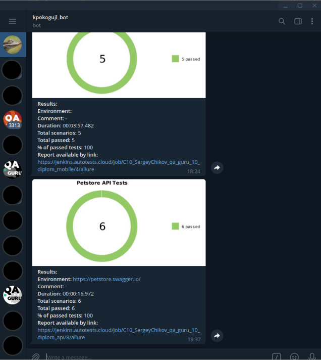

# Проект автоматизации тестирования API демо проекта petstore.swagger.io
Проект создан в рамках обучения в школе QA.GURU и представляет из себя часть выпускной работы.

Использованны слудующие технологии:

<p align="center">


</p>

# Описание проекта
Автоматизирована проверка двух ручек API:
- /pets
- /users

Используются: 
- модели (Lombok), 
- спецификации (RequestSpecification), 
- генерация тестовых данных (Faker), 
- конфигурации (Owner),
- проверки (AssertJ)
- шаблоны логирования запросов (AllureRestAssured FILTERS). 

# Запуск тестов
Локальный запуск осуществляется командой: 
```
gradle clean test -Dthreads=4
```
Где `threads` - количество потоков параллельного запуска тестов.

Для запуска тестов в Jenkins используется следующая команда:
```
clean
test
-DbaseUrl=${BASEURL}
```
Где:
`${BASEURL}` - url API для теста (прменяется для прогоне тестов на разном окружении).
 
**Note:** *в Jenkins не используется многопоточный запуск, чтобы не нагружать ресурсы школы!* 

# Запуск тестов в Jenkins выглядит следующим образом
Главная страница сборки


Выбор параметров сборки


Работа сборки


Отчет о выполнении тестов


Каждый тест, независимо от результата, состоит из:
- шагов, 
- лога запроса,
- лога ответа. 


Каждый запрос и ответ API логируется в удобном виде с помощью настраиваемых шаблонов


Тесты запускаются в многопоточном режиме


# По резултатам работы тестов отправляется краткий отчет в Telegram


# Создан проект в Allure TestOps
Тесты в проекте импортированы из кода, то есть не приходится писать тесты и автоматизировать их.
Достаточно написать автотест, а кейс в TMS всегда будет в актуальном состоянии. Так же, на проекте есть ручные тесты.


# Настроена интеграция Jenkins и Allure TestOps
Запуск джоб осуществляется из интерфейса Allure TestOps


Результаты работы джоб также отображаются в Allure TestOps


# Настроен дашборд с разными показателями
Отображаются графики тренда автоматизации, последний запуск и т.д.


